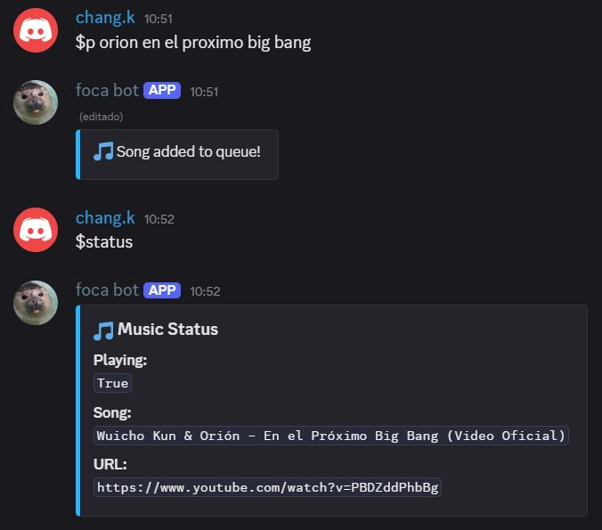

# 🎶 Welcome to Foca Bot

**Foca Bot** started as a simple Discord music bot. Over time, it has evolved into a multifunctional assistant tailored for my personal Discord server. Here's what it can do so far:

## 🛠️ Features
- 🎵 Play music from YouTube
- 🔍 Search for songs on YouTube
- 💰 Basic server economy
- 🎫 Lottery scratchers
- 🎰 Casino-style mini games
- 🗣️ Text-to-Speech for general AI questions
- 🤖 AI-powered Study Buddy using agent-based interaction
- 🚧 ...and more features coming soon!

## ⚠️ Important Notes

- **Audio streaming does not work on Skyline's network** due to firewall restrictions.

---

## 📸 Screenshots

Here are some previews of Foca Bot in action:

<p align="center">
  
  <br>
  <em>Foca Bot playing music from YouTube</em>
</p>

<p align="center">
  
  <br>
  <em>Some server economy features</em>
</p>

<p align="center">
  
  <br>
  <em>AI-powered Study Buddy using agents</em>
</p>


<p align="center">
  
  <br>
  <em>Answering questions using AI adn TTS</em>
</p>

---

## 🚀 Installation

### 1. Install dependencies

```bash
npm install ffmpeg-static
python -m venv venv
```

On Windows
```bash
venv\Scripts\activate
pip install -r requirements.txt
```
On Linux/macOS:
```bash
source venv/bin/activate
pip install -r requirements.txt
```

### 2. Run the bot

On Windows
```bash
venv\Scripts\activate
$env:PATH = "$PWD\node_modules\ffmpeg-static;$env:PATH"
python main.py
```
On Linux/macOS:
```bash
source venv/bin/activate
export PATH="$PWD/node_modules/ffmpeg-static:$PATH"
python main.py
```

## License
[MIT](https://choosealicense.com/licenses/mit/)
